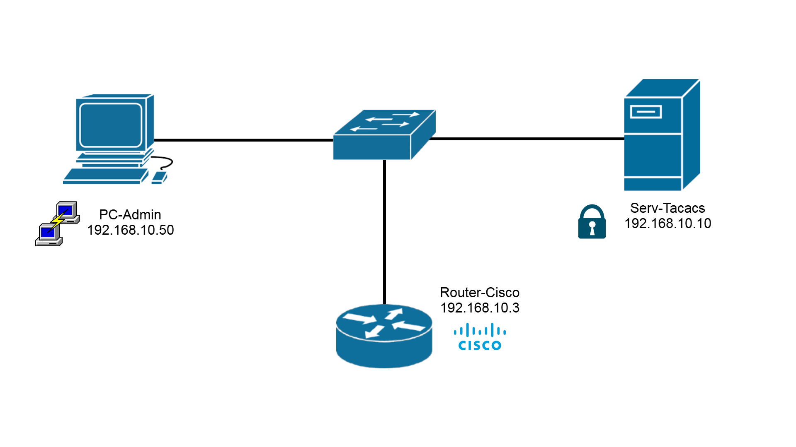
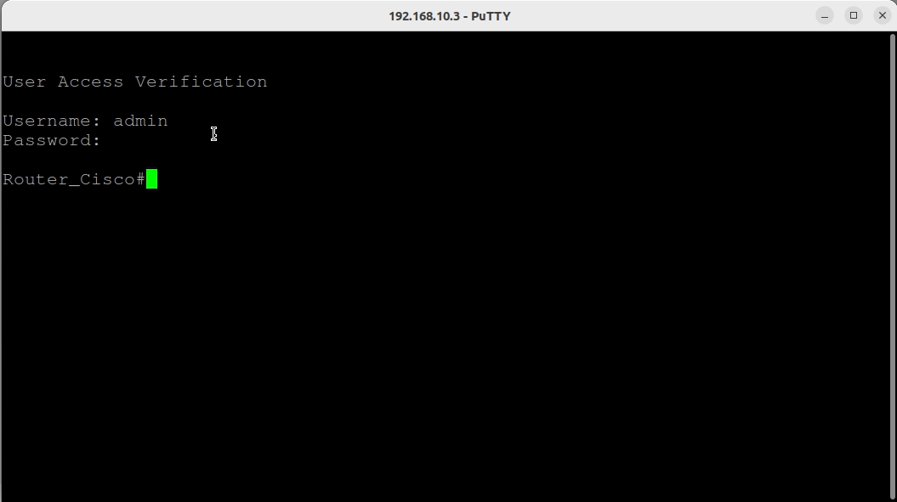
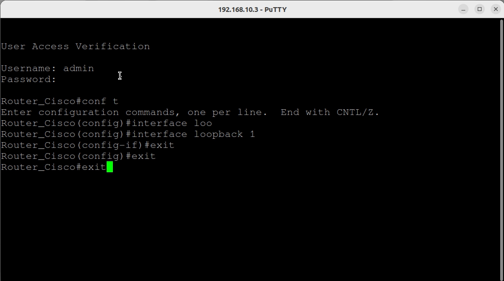
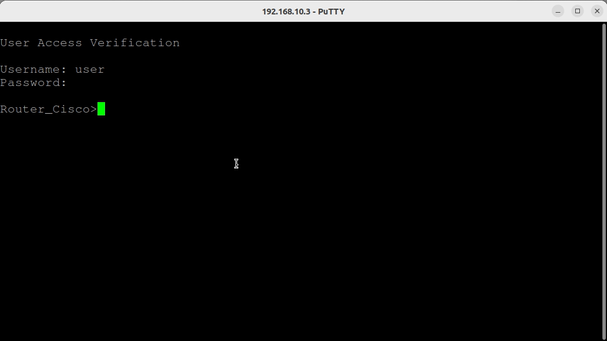
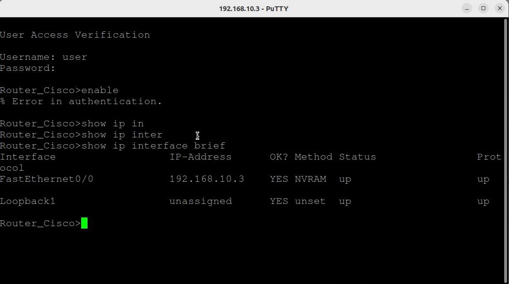
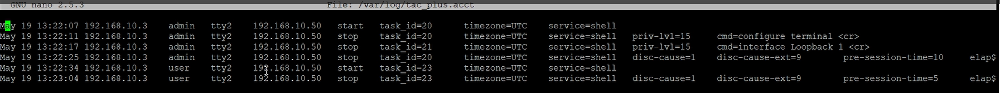

# Laboratorio de Cisco AAA con TACACS+

## Descripción General

Este proyecto demuestra la implementación de una arquitectura centralizada de AAA (Autenticación, Autorización y Contabilidad) utilizando TACACS+ integrado con Cisco IOS en un entorno EVE-NG.

El objetivo principal es eliminar la gestión de usuarios locales en los dispositivos de red e implementar un control de acceso centralizado mediante Control de Acceso Basado en Roles (RBAC), garantizando un acceso administrativo seguro y totalmente auditable.

## 🎯 Objetivos

Los objetivos principales de este laboratorio son:

- Implementar un sistema centralizado de Autenticación, Autorización y Contabilidad (AAA) mediante TACACS+.
- Reemplazar la administración de usuarios locales por un sistema de control de acceso centralizado.
- Aplicar el Control de Acceso Basado en Roles (RBAC) en dispositivos Cisco IOS.
- Restringir las acciones de los usuarios en función de niveles de privilegio definidos.
- Habilitar la autorización a nivel de comandos para los diferentes roles de usuario.
- Proporcionar un registro completo (Accounting) y auditoría de todas las acciones administrativas.
- Garantizar la autenticación de contingencia (fallback) utilizando credenciales locales en caso de fallo del servidor TACACS+.

## 🏗️ Topología de Red

El laboratorio está estructurado en torno a una arquitectura de red simplificada, diseñada para simular la autenticación centralizada AAA con TACACS+.

Se utiliza un único segmento LAN (`192.168.10.0/24`) donde todos los dispositivos se comunican dentro de un entorno controlado.

El servidor TACACS+ actúa como el componente central de seguridad del laboratorio, procesando todas las solicitudes de autenticación, autorización y contabilidad provenientes de los dispositivos de red.

Se emplea una estación de trabajo de administración para simular a un operador real realizando accesos remotos.



| Dispositivo | Interfaz | Dirección IP | Rol |
|---|---|---|---|
| Servidor TACACS (Ubuntu 16.04) | e0 | 192.168.10.10 | Servidor AAA |
| Router Cisco (IOS 7200) | fa0/0 | 192.168.10.3 | Cliente TACACS |
| PC-Admin (Ubuntu 22.04) | e0 | 192.168.10.50 | Host de Gestión |

## 🔐 Control de Acceso Basado en Roles (RBAC)

El laboratorio implementa el Control de Acceso Basado en Roles (RBAC) para aplicar el principio del menor privilegio y separar las funciones administrativas de las tareas básicas de monitorización. 

Se han definido dos roles de usuario en el servidor TACACS+:

#### Administrador Total (Super Administrator)

- Grupo: grp_superadmin  
- Nivel de privilegio: 15 (acceso administrativo total)  
- Permisos: Acceso de lectura, escritura y configuración completa.  
- Asignación en Cisco: Modo de ejecución privilegiada (Enable mode) + privilegios EXEC totales.  

#### Operador Junior (Junior Operator)

- Grupo: grp_junior  
- Nivel de privilegio: 1 (acceso de solo lectura)  
- Permisos: Limitado a comandos de diagnóstico y monitorización.  
- Comandos permitidos: Comandos show.  
- Asignación en Cisco: Modo EXEC de usuario con acceso restringido.

## ⚙️ Despliegue del Servidor TACACS+ (Ubuntu)

El servicio TACACS+ se despliega en un servidor Ubuntu para proporcionar Autenticación, Autorización y Contabilidad (AAA) centralizada a los dispositivos de red.

### Instalación

El demonio de TACACS+ se instala desde los repositorios oficiales de Ubuntu:

```bash
sudo apt update
sudo apt install tacacs+
```

### Configuración de Registros (Logs)

Se crea un directorio dedicado para almacenar los registros de contabilidad (accounting):

```bash
sudo mkdir -p /var/log/tacacs
sudo chown tacacs:tacacs /var/log/tacacs
```

### Configuración de TACACS+

El archivo de configuración principal define las políticas de autenticación, autorización y contabilidad:

```bash
/etc/tacacs+/tac_plus.conf
```
Esta configuración incluye:

- Clave compartida para la autenticación de dispositivos  
- Archivo de accounting para el registro de sesiones y comandos  
- Grupos basados en Role-Based Access Control (RBAC)  
- Asignación de usuarios a sus respectivos roles  

---

### Ejemplo de Configuración

```text
# Clave secreta compartida
key = "key1234"

# Archivo de accounting
accounting file = /var/log/tac_plus.acct

# Grupo Super Administrador
group = grp_superadmin {
    default service = permit
    service = exec { priv-lvl = 15 }
}

# Grupo Operador Junior
group = grp_junior {
    service = exec { priv-lvl = 1 }
    cmd = show { permit .* }
    cmd = exit { permit .* }
}

# Usuarios
user = admin { login = cleartext "admin123" member = grp_superadmin }
user = user { login = cleartext "user123" member = grp_junior }
```

### Gestión del Servicio

Tras aplicar los cambios de configuración, se reinicia y se verifica el estado del servicio:

```bash
sudo systemctl restart tacacs+
sudo systemctl status tacacs+
```

## 🔐 Configuración de AAA en Cisco IOS

El router Cisco se configura para delegar la Autenticación, Autorización y Contabilidad (AAA) en el servidor TACACS+.

### Definición del Servidor TACACS+

Se declara el servidor TACACS+ utilizando su dirección IP y la clave secreta compartida definida previamente en el servidor Ubuntu.

```text
conf t
aaa new-model

tacacs server TACACS-SRV
 address ipv4 192.168.10.10
 key key1234

exit
```

### Políticas AAA

Se configuran las listas de métodos AAA por defecto para la autenticación, autorización y contabilidad. 

La autenticación local se añade como un mecanismo de contingencia (*fallback*) en caso de que el servidor TACACS+ deje de estar disponible.

```text
aaa authentication login default group tacacs+ local
aaa authorization exec default group tacacs+ local
aaa authorization commands 15 default group tacacs+ local
aaa authorization commands 1 default group tacacs+ local
aaa accounting exec default start-stop group tacacs+
aaa accounting commands 15 default start-stop group tacacs+
aaa accounting commands 1 default start-stop group tacacs+
```

> ⚠️ **Nota Crítica de Contingencia (Fallback)**: En entornos reales, es imperativo mantener una cuenta de administración local en el dispositivo de red y configurar local como último método en la lista de AAA. Esto garantiza que si el servidor TACACS+ queda inalcanzable (por fallos de red o caída del servicio), los administradores no queden totalmente fuera del equipo (lockout). El router solo recurrirá a la base de datos local si el servidor TACACS+ no responde; si el servidor responde que las credenciales son incorrectas, el acceso se deniega y no se aplica el fallback.

### Verificación de AAA

La configuración activa de AAA se puede validar con el siguiente comando:

```text
show run | include aaa
```

Resultado esperado:

```text
aaa new-model
aaa authentication login default group tacacs+ local
aaa authorization exec default group tacacs+ local
aaa authorization commands 1 default group tacacs+ local
aaa authorization commands 15 default group tacacs+ local
aaa accounting exec default start-stop group tacacs+
aaa accounting commands 1 default start-stop group tacacs+
aaa accounting commands 15 default start-stop group tacacs+
aaa session-id common
```

### Configuración de Acceso Remoto (Opcional)

Para aplicar las políticas AAA a los accesos remotos de administración (Telnet/SSH), las líneas VTY deben hacer referencia a las listas de métodos AAA.

```text
line vty 0 4
 login authentication default
 authorization exec default
 authorization commands 1 default
 authorization commands 15 default
 transport input ssh telnet
exit
```

### SSH se habilita con los siguientes comandos:

```text
ip domain-name lab.com
crypto key generate rsa modulus 2048
ip ssh version 2
```

### Autorización en Consola (Opcional)

La autorización AAA también puede extenderse al acceso físico o por puerto de consola:

```text
aaa authorization console

line console 0
 login authentication default
 authorization exec default
exit
```

### Verificación de Conectividad TACACS+

La comunicación directa entre el router Cisco y el servidor TACACS+ se valida mediante:

```text
show tacacs
```

Resultado esperado:

```text
Tacacs+ Server - public :
            Server address: 192.168.10.10
               Server port: 49
              Socket opens:         40
             Socket closes:         40
             Socket aborts:          0
             Socket errors:          0
           Socket Timeouts:          0
   Failed Connect Attempts:          0
        Total Packets Sent:         56
        Total Packets Recv:         56
```

## 🧪 Pruebas y Verificación

Para validar la correcta funcionamiento de la implementación AAA, se probaron los distintos escenarios operativos desde una estación de trabajo de gestión utilizando PuTTY.

> ⚠️ **Nota de Producción:** Este laboratorio utiliza exclusivamente Telnet (Puerto 23) con el fin de realizar un prototipado rápido en un entorno controlado. En redes de producción, las normativas de seguridad exigen deshabilitar los protocolos de gestión no cifrados e imponer estrictamente el uso de **SSH (v2)**.

---

#### 1. Acceso de Administrador Total y Autorización de Privilegios Completos

Al conectarse utilizando las credenciales de `admin_lab`, el sistema posiciona al usuario directamente en el **nivel de privilegio 15**, indicado por el símbolo `#` en el prompt.



Para verificar la autorización total al realizar cambios estructurales, se accedió al modo de configuración global y se creó una interfaz loopback sin ningún tipo de restricción:



---

#### 2. Acceso de Operador Junior y Restricciones de Comandos

Al iniciar sesión con las credenciales del Operador Junior (`user_junior`), el sistema otorga el **nivel de privilegio 1**, restringiendo el entorno al prompt con el símbolo `>`.



Bajo este perfil restringido, cualquier intento de escalada de privilegios a través del comando `enable` es completamente denegado por el servidor TACACS+. El usuario está autorizado para realizar tareas de monitorización (como ejecutar `show ip interface brief`), pero no puede aplicar modificaciones globales en el sistema.



---

#### 3. Registro de Auditoría Centralizado (Logs de Contabilidad)

Cada estado de conexión y comando ejecutado queda registrado de forma centralizada en el demonio TACACS+. Para auditar las acciones administrativas, se inspecciona el archivo de seguimiento central:

```text
tacacs@tacacs:~$ sudo nano /var/log/tacacs/tac_plus.acct
```



```text
May 19 13:22:07 192.168.10.3    admin   tty2    192.168.10.50   start   task_id=20      timezone=UTC    service=shell
May 19 13:22:11 192.168.10.3    admin   tty2    192.168.10.50   stop    task_id=20      timezone=UTC    service=shell   priv-lvl=15     cmd=configure terminal <cr>
May 19 13:22:17 192.168.10.3    admin   tty2    192.168.10.50   stop    task_id=21      timezone=UTC    service=shell   priv-lvl=15     cmd=interface Loopback 1 <cr>
May 19 13:22:25 192.168.10.3    admin   tty2    192.168.10.50   stop    task_id=20      timezone=UTC    service=shell   disc-cause=1    disc-cause-ext=9        pre-session-time=10     elap$
May 19 13:22:34 192.168.10.3    user    tty2    192.168.10.50   start   task_id=23      timezone=UTC    service=shell
May 19 13:23:04 192.168.10.3    user    tty2    192.168.10.50   stop    task_id=23      timezone=UTC    service=shell   disc-cause=1    disc-cause-ext=9        pre-session-time=5
```

## 🔍 Resolución de Problemas (Troubleshooting)

Si ocurren fallos de autenticación o autorización durante las pruebas, se deben utilizar los siguientes comandos de diagnóstico en Cisco IOS para aislar e identificar la causa raíz:

* `debug aaa authentication` – Supervisa el intercambio de autenticación paso a paso para verificar la coincidencia de usuarios.
* `debug aaa authorization` – Valida el procesamiento de comandos y los atributos de nivel de privilegio devueltos por el servidor TACACS+.
* `debug tacacs` – Rastrea la sincronización de paquetes en bruto, los tiempos de respuesta y la conectividad a nivel de la capa de transporte con el servidor Ubuntu.
